# APPS30: Modernizing Your Application with Containers

 

## Session Abstract

Tailwind Traders’ recently moved one of its core applications from a virtual machine into containers, gaining deployment flexibility and repeatable builds.

In this session, you’ll learn how to manage containers for deployment, options for container registries, and ways to manage and scale deployed containers.

## Table of Content

| Resources          | Links                            |
|-------------------|----------------------------------|
| PowerPoint        | - [Presentation](presentations.md) |
| Videos            | - [Dry Run Rehearsal](https://globaleventcdn.blob.core.windows.net/assets/apps/apps30/app30-dryrun.mp4) <br/>- [Microsoft Ignite Orlando Recording](https://myignite.techcommunity.microsoft.com/sessions/83032) |
| Demos             | - [Demo 1](example-notes.txt) |

## How To Use

Welcome, Presenter! 

We're glad you are here and look forward to your delivery of this amazing content. As an experienced presenter, we know you know HOW to present so this guide will focus on WHAT you need to present. It will provide you a full run-through of the presentation created by the presentation design team. 

Along with the video of the presentation, this document will link to all the assets you need to successfully present including PowerPoint slides and demo instructions & code.

1.  Read document in its entirety.
2.  Watch the video presentation
3.  Ask questions of the Lead Presenter


## Assets in Train-The-Trainer kit

- This guide
- [PowerPoint presentation](https://globaleventcdn.blob.core.windows.net/assets/apps/apps30/apps30.pptx)
- [Full-length recording of presentation](https://globaleventcdn.blob.core.windows.net/assets/apps/apps30/app30-dryrun.mp4)
- [Full-length recording of from Ignite 2019](https://myignite.techcommunity.microsoft.com/sessions/83032?source=speakerdetail)
- [Full-length recording of presentation - Director Cut](https://www.youtube.com/watch?v=ISQ7EMTvl4U&feature=youtu.be)
- [Demo Instructions](https://github.com/microsoft/ignite-learning-paths-training-apps/tree/master/apps30)

---

## Pre-requisites

The following Azure Resources are needed to run this demo:

- Resource Group
- Virtual Network
- Cosmos Database (MongoDB)
- SQL Database (Includes SQL Server Instance, Firewall Rule, and DB)
- Azure Container Registry
- Azure App Service Plan **(A Linux App Service Plan is required for WebApp for Containers)** (S1 SKU is recommended)
- Azure Web App

And of course, the web app itself: [TailWind Traders Website](https://github.com/anthonychu/TailwindTraders-Website)

Your webapp will need the following appsettings to work:

| Variable Name     | Default Value    |
|-------------------|---------------------- |
| apiUrl          | /appi/v1 |  
| ApiUrlShoppingCart          | /appi/v1 |  
| productImagesUrl         | https://raw.githubusercontent.com/microsoft/TailwindTraders-Backend/master/Deploy/tailwindtraders-images/product-detail |  
| SqlConnectionString          |  |  
| MongoConnectionString        |  |  

**Note: `productImagesUrl` will 404 if you navigate to it manually. This is expected behavior because of the way the app itself is written - this is just the base url for product images. The value is correct.


## Getting started

First, fork this repo - this will help you create the infrastructure. 

Second, fork the [TailWind Traders Website repo](https://github.com/anthonychu/TailwindTraders-Website) - this is the app you will be deploying into the infrastructure.

You can setup the required resources 3 ways:

- [Azure DevOps Pipeline](azds_pipeline.yml)
    - If you prefer this method, [click here](#azure-devops-pipeline).

- [GitHub Actions Pipeline]()
    - If you prefer this method, [click here](#github-actions-pipeline).

- Manually via cloud shell or local terminal and the provided [`infraCreate.sh`](scripts/infra_create.sh) script.
    - If you prefer this method, [click here](#cloud-shell-terminal-infra-setup).

---

## Azure DevOps Pipeline

Install the [Azure Pipelines app](https://github.com/marketplace/azure-pipelines) in your [GitHub](https://github.com/) account

In Azure DevOps under Preview features, enable multi-stage pipelines.

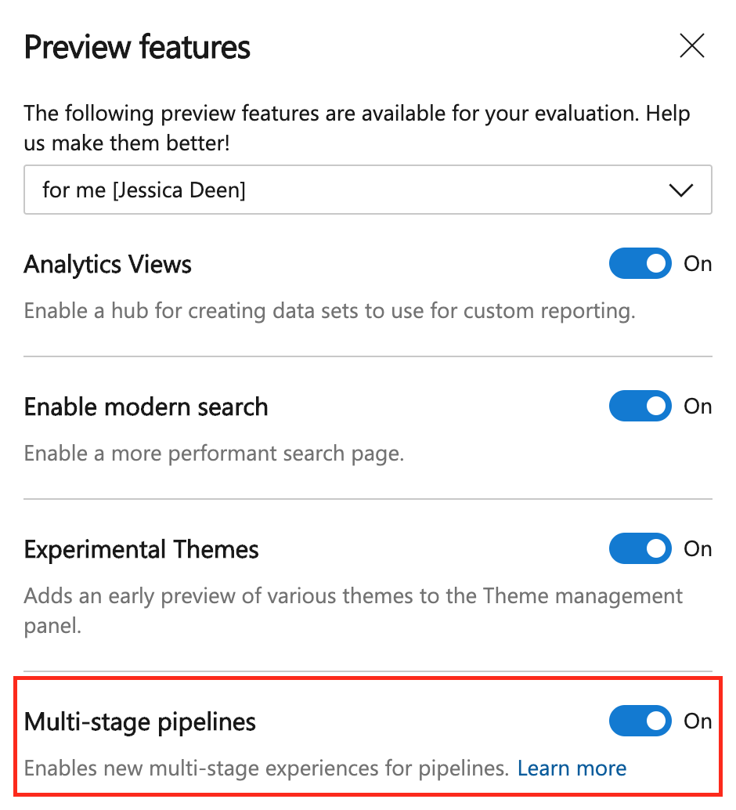

Navigate to Piplines and click "Create pipeline."

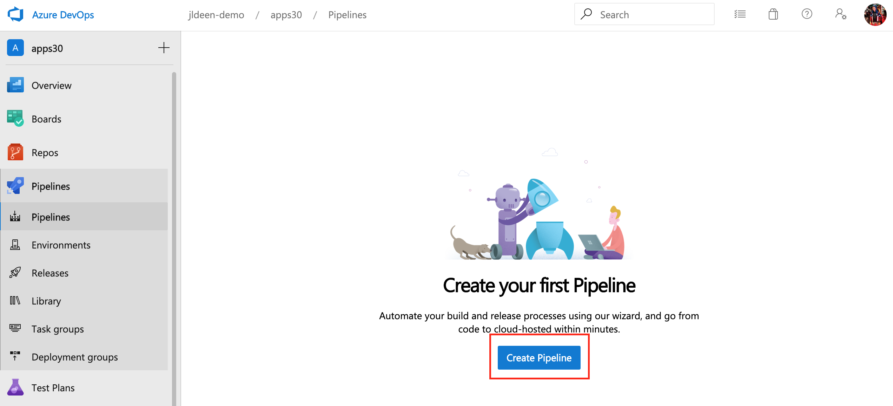

Under "Where is your Code?" Select GitHub.

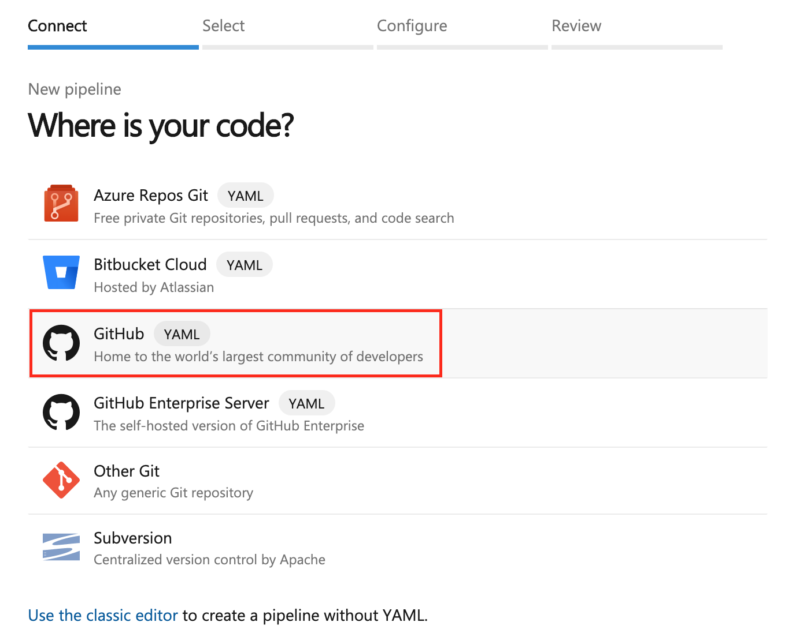

Select your fork of this repository.

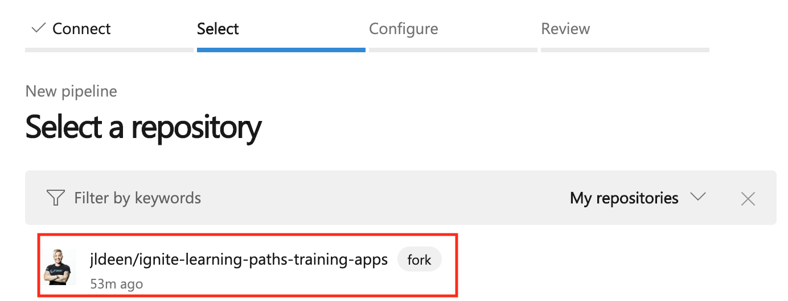

Under "Configure your pipeline" select "Existing Azure Pipelines YAML file

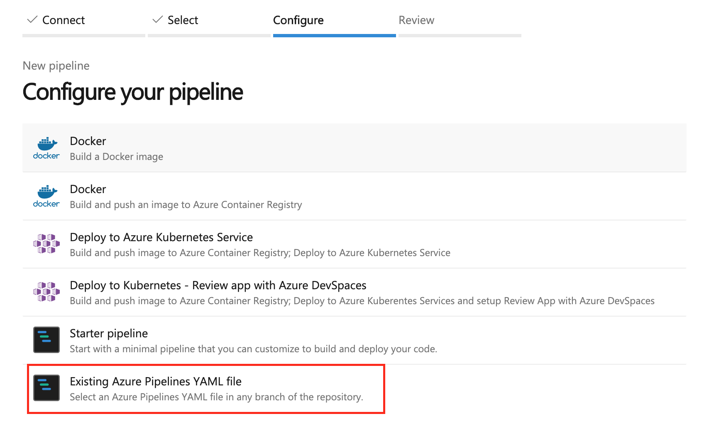

From there, you can leave the default branch as master. 

You can either use the drop down for path to select the pipeline yml or manually type the path:

`/apps/30/azds_pipeline.yml`

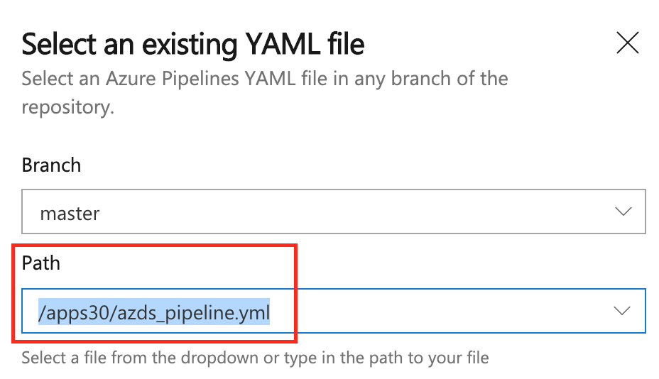

Hit continue when you're done.

**Note:** There are two Azure DevOps pipelines. `azds_pipeline.yml` will deploy all resources needed for this demo; `teardown/teardown.azds_pipeline.yml` will tear down all resources for this demo.

The next screen will allow you to review your pipeline and make any necessary changes to the yaml. You can use the web editor to change the variables starting at line 17. You will also need to add `adminUser` and `adminPassword` as secret variables by clicking "Variables" in the top right next to "Run."

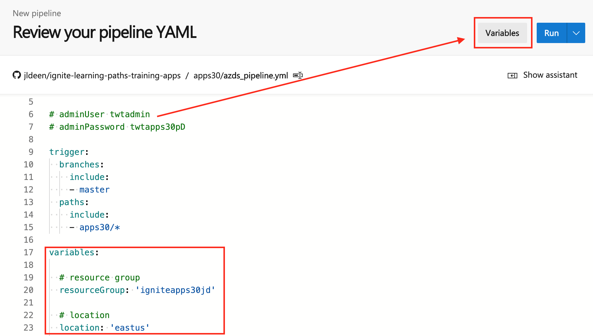

Under variables, click "New Variable."

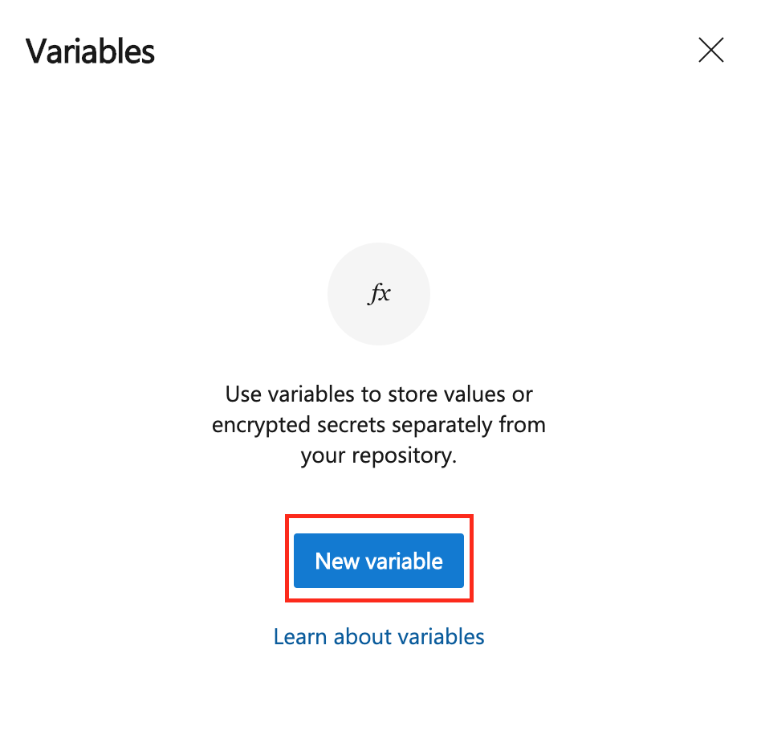

Enter the name and value of the variable, and be sure to check the box "Keep this value secret" to encrypt the variable.

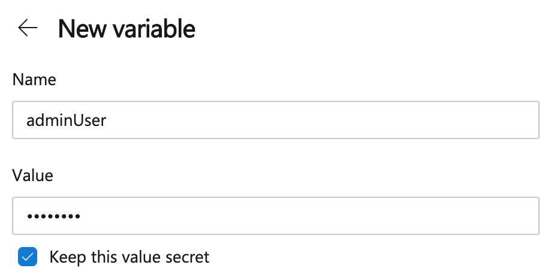

Once you've added both `adminUser` and `adminPassword` you can click "Save."

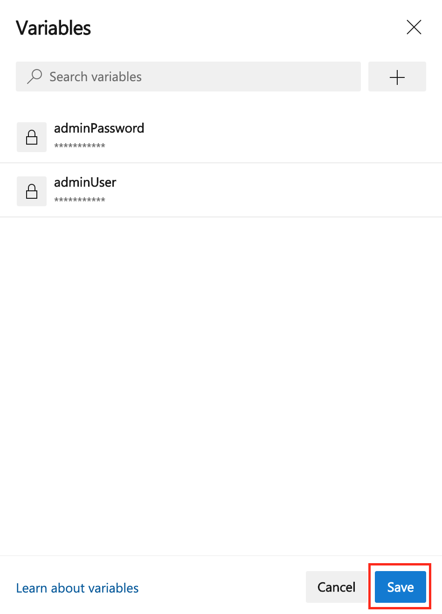

After you have updated all inline variables for the pipeline, you can click "Save and Run."

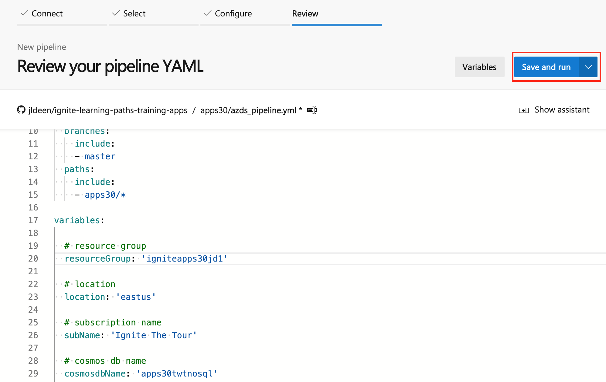

This will bring up a second popup where you will commit your new changes directly to your master branch (or any branch of your choice) and then run the pipeline! Be sure to click "Save and Run" again to fire off the pipeline.

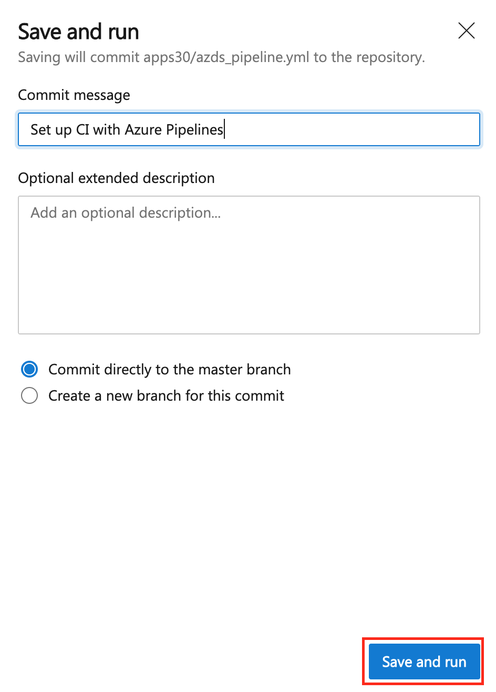

This will take about 15 minutes to deploy and once it completes, you can proceed with deploying the web app itself using GitHub Actions.

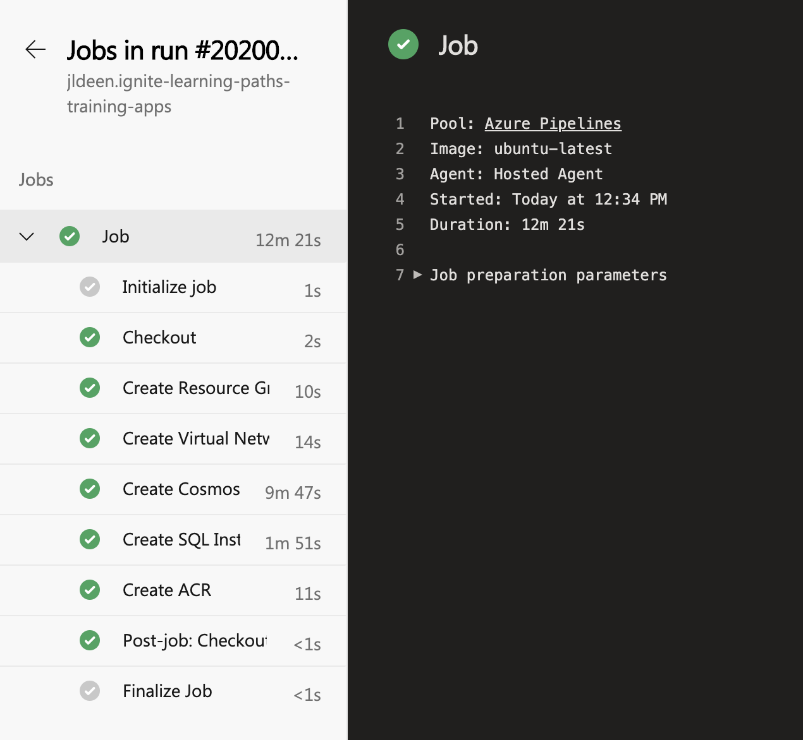

---

## GitHub Actions Pipeline

**We will be using the [TailWind Traders web application repo](https://github.com/anthonychu/TailwindTraders-Website) for this section since the code we need, including the GitHub Actions workflow lives there.**

As of the time of this update (January 2019), [GitHub Actions](https://help.github.com/en/actions/automating-your-workflow-with-github-actions/about-github-actions) does not support on demand run for an Actions workflow. With that in mind, it is probably easier to keep the infrastructure deployment as part of a controlled pipeline using Azure DevOps, but we have included the GitHub Actions infra deploy job as a bonus. 

Also, because of how GitHub Actions workflows work, the workflow needs to be in the root of the repo. 

There are two workflows you can use. One will deploy everything: the infrastructure and web app `apps30-full-CICD.yml`. One will deploy just the web app, depending on your preference `apps30-app-CICD.yml`.

You will find the workflows in the [IaC folder](Iac/) of this repo and you will need to copy the workflow of your choice to the TailWind Traders repo. 

Once you have decided on your preferred workflow, run `mkdir -p .github/workflows` in the **TailWind Traders Repo** to make the necessary GitHub workflow folder path. From there, copy the the workflow you chose into the new folder in the **TailWind Traders Repo** you just created.

In order for either workflow to run successfully, you will need to add secrets under Settings in your fork. You can learn how to add secrets to your GitHub Repo [here](https://help.github.com/en/actions/automating-your-workflow-with-github-actions/creating-and-using-encrypted-secrets).

We have created simple scripts [Get Infra Secrets](scripts/get-infra-secrets.sh) and [Get all Secrets](get-secrets.sh) to help with this.

Before running the script, you will want to update lines 9-18 of the script files with your desired variables. These should the variables on lines 6-12 on your desired workflow.

It is also recommended to setup your own self hosted GitHub actions runner to help with time of repeated runs, in particular, the time of the Docker build step. You can learn more about how to do that [here](https://help.github.com/en/actions/automating-your-workflow-with-github-actions/adding-self-hosted-runners). Both workflows are setup to run on self-hosted runners and will need to be updated to work with standard linux by changing any mention of `self-hosted` to `ubuntu-latest`.

A description of the variables, as well as their default values, can be found below.

| Variable Name          | Default Value         | Description              |
|-------------------|----------------------------------|------------------- |
| spName           | tailwindtraders30 | Name of the service principal used for GitHub Actions; one will be created for you by default 
| resourceGroup            | igniteapps30 | Name of the resource group used
| subName           | "Ignite The Tour" | Name of the subscription where all resources will be deployed
| location           | eastus | Azure region used for all resources
| cosmosDBName          | apps30twtnosql | Name of the mongoDB/Cosmos DB instance
| sqlDBName          | apps30twtsql | Name of the SQL DB instance
| adminUser           | twtadmin | Name of the SQL admin user
| adminPassword          | twtapps30pD | Name of the SQL admin user password
| acrName           | igniteapps30acr | Name of the Azure Container Registry. This name has to be unique.
| webappName          | igniteapps30 | Name of the Azure webapp and App Service Plan

The scripts will produce the following values for you to set as secrets in your GitHub Actions workflow.

- AZURE_CREDENTIALS
- SQL_ADMIN
- SQL_PASSWORD
- MONGODB_CONNECTION_STRING
- SQL_CONNECTION_STRING
- CONTAINER_REGISTRY
- REGISTRY_USERNAME
- REGISTRY_PASSWORD

Note: `AZURE_CREDENTIALS` will produce a value like this. The entire json snippet is your GitHub Secret - copy all of it to your clipboard:
```
{
  "clientId": "ba99fdsa-fdas9jfaf-fjkdajf989-fjdkafjs",
  "clientSecret": "989f9ja-fjdsf-fjkd-fmmk-jaflsjdf",
  "subscriptionId": "cd400f31-6f94-40ab-863a-673192a3c0d0",
  "tenantId": "98ijkaf-fjkaf9-fjkmmmk-kjaki9kalm",
  "activeDirectoryEndpointUrl": "https://login.microsoftonline.com",
  "resourceManagerEndpointUrl": "https://management.azure.com/",
  "activeDirectoryGraphResourceId": "https://graph.windows.net/",
  "sqlManagementEndpointUrl": "https://management.core.windows.net:8443/",
  "galleryEndpointUrl": "https://gallery.azure.com/",
  "managementEndpointUrl": "https://management.core.windows.net/"
}
```
If you already have a service principal you wish to use, simply copy the above snippet and change the values for `clientId`, `clientSecret`, `subscriptionId` and `tenantId`. You can then comment out lines 19-22 of the `get-infra-secrets.sh` and `get-secrets.sh` script and add in `az version > /dev/null` so the following if statement runs successfully.

---
**FULL CICD Things to Note**

If you use the Full CICD workflow, you will have to run the GitHub Actions workflow twice to have a fully successful build, assuming your infrastructure is being created for the first time. This is because some of the secrets you need (connection strings and registry information) will not be available until the first job (infraDeploy) completes. To help with this, there is a `get-infra-secrets.sh` shell script that will provide only the following values; run this first.

Initial GitHub Secrets needed:

- AZURE_CREDENTIALS
- SQL_ADMIN
- SQL_PASSWORD

This will allow you to start the workflow and create the infrastructure using the first job of the workflow. Once the `deployInfra` job completes and the `buildContainer` job begins (expect the second job to fail due to missing secret values), run the `get-secrets.sh` script to get the remaining GitHub Secrets. You can leave the existing values for `AZURE_CREDENTIALS`, `SQL_ADMIN`, and `SQL_PASSWORD` as is.

Remaining GitHub Secrets needed:

- MONGODB_CONNECTION_STRING
- SQL_CONNECTION_STRING
- CONTAINER_REGISTRY
- REGISTRY_USERNAME
- REGISTRY_PASSWORD

**Note: `SQL_CONNECTION_STRING` will need to be updated with the provided `SQL_ADMIN` and `SQL_PASSWORD` values.** 

**Example:**

`SQL_CONNECTION_STRING: Server=tcp:apps30twtsql.database.windows.net,1433;Database=tailwind;User ID=<username>;Password=<password>;Encrypt=true;Connection Timeout=30;`

should change to

`SQL_CONNECTION_STRING: Server=tcp:apps30twtsql.database.windows.net,1433;Database=tailwind;User ID=twtadmin;Password=twtapps30pD;Encrypt=true;Connection Timeout=30;`

**Make special note of the changed values for "User Id=" and "Password="**

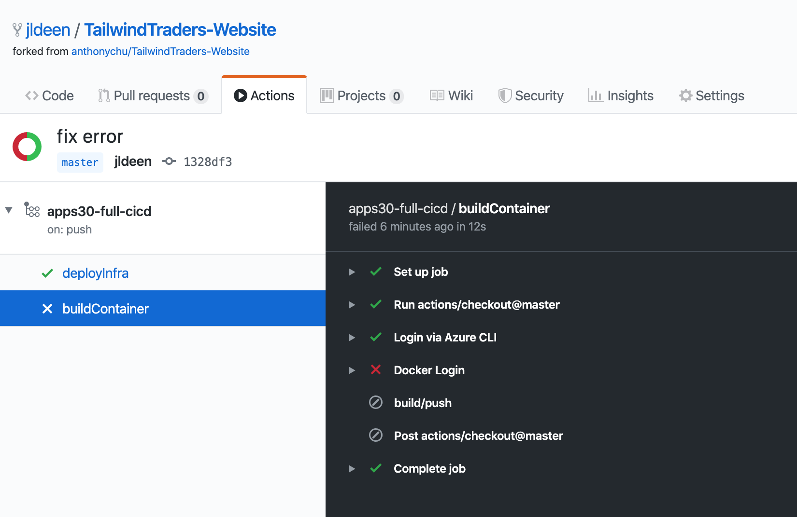

Assuming the second job, `buildContainer` has failed and you have added in the remaining secrets, you can re-run all checks and the workflow should complete all 3 jobs.

- deployInfra
- buildContainer
- deployContainer

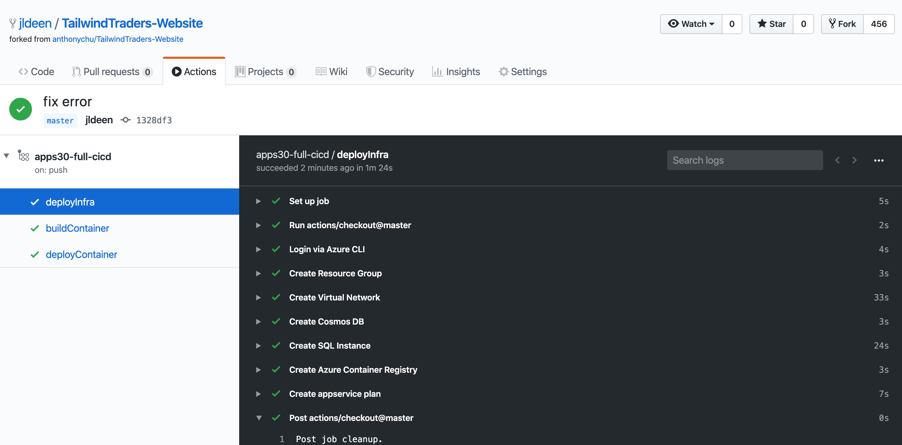

Moving forward, the full CICD will run incrementally for the infra part, which takes around a minute for the job to complete; the full pipeline takes about 3 minutes to complete when using a self-hosted runner.

---

## Cloud Shell Terminal Infra Setup

To be added...

---

## Teardown

You can tear down all infrastructure two ways:

- [Azure DevOps Pipeline](teardown/teardown.azds_pipeline.yml)
    - Create a pipeline just like you did in the [Azure DevOps Pipeline section](#azure-devops-pipeline), only instead of selecting the `azds_pipeline.yml` INSTEAD select the `teardown/teardown.azds_pipeline.yml`

- Manually via cloud shell or local terminal and the provided [`teardown.sh`](teardown/teardown.sh) script.
    - Run the script in cloud shell or a local terminal session by typing `sh teardown.sh`

---

## Demoing Live

A rough demo workflow looks like this:

1. Create live demo Resource Group using Azure Cloud Shell
2. Create live demo VNET in Cloud Shell (then show them the vnet in portal)
3. Create live demo Create CosmosDB (This will take some time, so you can flip to the version you already created)
4. Create live demo Azure SQL
5. Clone repo in Cloud Shell
6. Create ACR in Cloud Shell
7. ACR BUILD image in Cloud Shell (show them where to find created image in PORTAL)
8. Demo how to create App Service INCLUDING Plan for containers IN PORTAL
9. Select ACR and image in the Web App container settings in IN PORTAL (CLICK THROUGH STEPS)
10. Show them APP SETTINGS and then show how to enter envrionment variables (do one), use your pre-show created version to show all the VARs.
11. Navigate to "pre-show" app with all settings, show the audience app, including inventory of an item.
12. Start talking about how while that was pretty easy to get up and running, there were a lot of moving parts. Explain how it can get overwhelming remembering all those steps. Ask the audience, "Wouldn't it be nice if we could truly modernize this and have a way to automate every step? Turns out there is." Segway into GitHub Actions and show them the completed GitHub Actions workflow with all 3 jobs. Explain the value behind true modernization by gaining deployment flexibility and repeatable builds - including the underlying infrastructure needed for the app to run.
13. Delete live demo resource group when finished.

## Become a Trained Presenter

To become a trained presenter, contact [scalablecontent@microsoft.com](mailto:scalablecontent@microsoft.com). In your email please include:

- Complete name:
- The code of this presentation: apps30
- Link (ex: unlisted YouTube video) to a video of you presenting (~10 minutes). 
  > It doesn't need to be this content, the important is to show your presenter skills

A mentor will get back to you with the information on the process.

## Trained Presenters

Thanks goes to these wonderful people ([emoji key](https://allcontributors.org/docs/en/emoji-key)):

<!-- ALL-CONTRIBUTORS-LIST:START - Do not remove or modify this section -->
<!-- prettier-ignore -->

<table>
<tr>
    <td align="center"><a href="http://cloud5mins.com/">
        <br />
        <sub><b>Jay Gordon</b></sub></a><br />
            <a href="https://github.com/neilpeterson/ignite-tour-fy20/commits?author=jaydestro" title="talk">📢</a>
            <a href="https://github.com/neilpeterson/ignite-tour-fy20/commits?author=jaydestro" title="Documentation">📖</a> 
    </td>
</tr></table>

<!-- ALL-CONTRIBUTORS-LIST:END -->

